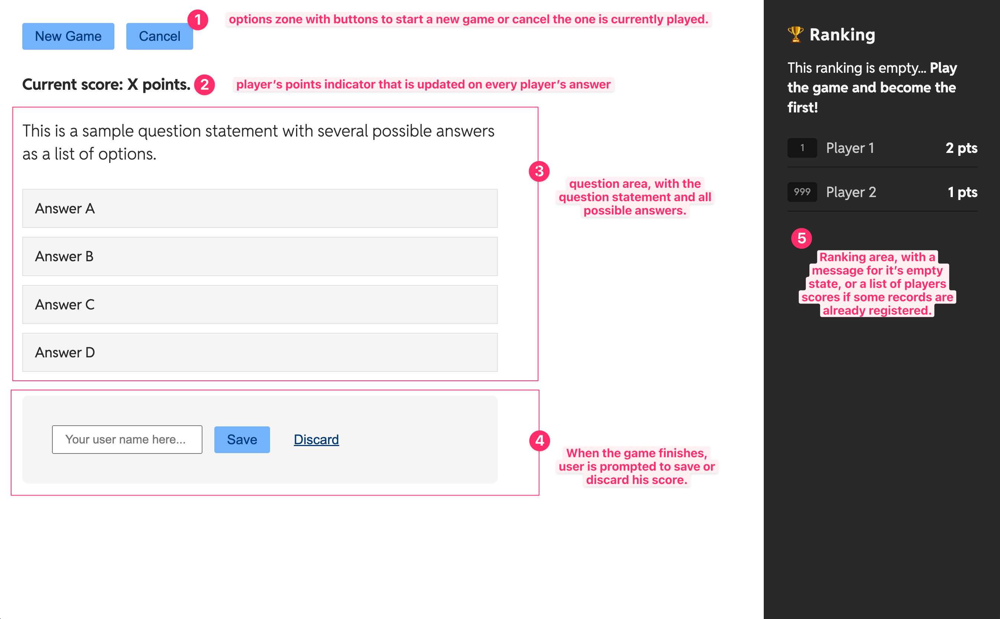

# Trivia Game

Selected exercise from the 'Web Programming' course within the Bachelor's degree in Software Development. This project consisted in developing a Single-page Application in Vanilla JavaScript, that fetches data from a public API. 

## Brief description

"In this practice, we are going to implement a Single Page Application (without routing) that consumes a public API using fetch.

The app’s main goal is to create a simple trivia game using a public [Open Trivia DataBase](https://opentdb.com/api_config.php) API. Players have to pass a 5 questions test, each one from a different knowledge category, where every question could give them 2 points.

The game will have a ranking with the previous saved scores, so when the players finish the test they could save their scores filling a nickname input if they want. This ranking would have a persistent behaviour using cookies.

At the end, our application should solve the following main features:
- Play a trivia game iterating over 5 questions, each one from a different category.
- Manage an API avoiding repeated questions for the “same session” through
session token usage.
- Allow players to save their final score in the ranking with the provided player name."

### Screenshot

